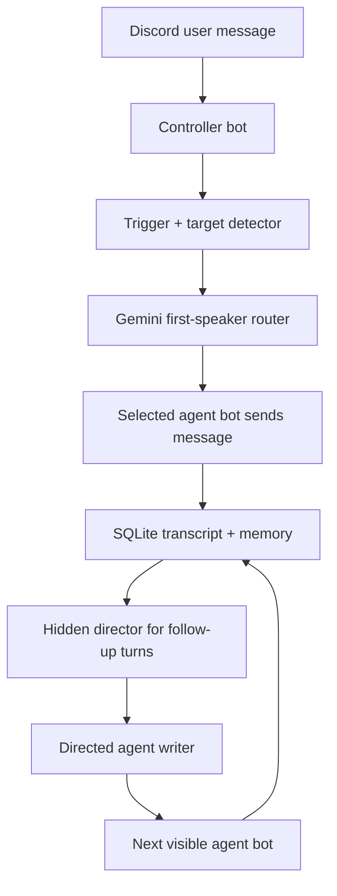

# Karpathy's Basement

A Discord room where simulated AI-research personas argue, react, and teach like a messy little research group chat.

This started as a simple bot experiment and turned into a multi-agent Discord simulator: separate bot accounts, persistent memory, Gemini orchestration, human-ish typing delays, tone controls, and a hidden room director that decides who should jump in next.

The goal is not to impersonate real researchers. The goal is to make studying AI research feel more alive than reading a static thread alone.

## What It Feels Like

You ask:

```text
ilya is scaling dead?
```

The room might unfold like:

```text
Ilya: wait. the loss curve is still moving, but the slope is changing. that's where the real work is.
Yann: no, the wrong abstraction is pretending token prediction gives you a world model for free.
Demis: careful. the useful question is what benchmark separates scale from planning.
Karpathy: lol the annoying part is all three of you are touching the same thing: data, objective, eval.
```

The fun is not that every answer is perfect. The fun is that the agents have different research tastes, interrupt each other, and keep the conversation moving.

## The Agents

The current room uses educational simulations based on public research themes:

| Agent key | Display | Research taste |
| --- | --- | --- |
| `scaling_mystic` | Ilya Sutskever | scaling, generalization, loss curves, data limits, AGI cruxes |
| `systems_strategist` | Demis Hassabis | planning, search, RL, evaluation, scientific discovery |
| `world_modeler` | Yann LeCun | world models, latent representations, self-supervised learning, physical grounding |
| `neural_educator` | Andrej Karpathy | data, training dynamics, learned programs, practical model-building intuition |
| `deep_learning_sage` | Geoffrey Hinton | deep learning history, representations, backprop, older debates returning in new clothes |

These are not the real people, and the bot must not claim private beliefs, private access, personal memories, or current opinions. The profiles are grounded in public research themes and used for study/motivation.

## Features

- Multi-bot Discord setup: each active agent can have its own Discord bot account.
- Gemini-powered routing and replies.
- Hidden room director for follow-up turns.
- Agent-to-agent conversation instead of one bot dumping a panel answer.
- Persistent SQLite memory for room history, summaries, tone preferences, and user notes.
- Tone modes:
  - `!tone professional`
  - `!tone normal`
  - `!tone strict`
- Human-ish typing delays and staggered replies.
- Contextual pings like `demis?` continue the current thread instead of acting unaware.
- Student identity awareness so agents can occasionally use your display name or Discord mention.
- Secret-scan guardrail before committing.

## How It Works



There are two important Gemini layers:

1. **First-speaker router**
   Picks the first agent who should respond to the user's latest message.

2. **Hidden room director**
   For follow-up turns, decides whether another agent should speak, who it should be, what they are responding to, what topic they must stay locked on, and what derailments to avoid.

That extra director pass is what makes the room feel less like four independent bots and more like a conversation.

## Project Structure

```text
main.py                  # Entry point
multi_bot.py             # Discord multi-bot runtime and routing
gemini_client.py         # Gemini prompts, JSON schemas, orchestration, cleanup
agents.py                # agents.md loader
agents.md                # Agent profiles and public research-view anchors
memory_store.py          # SQLite persistence
bot_tokens.example.json  # Safe token config template
scripts/secret_scan.py   # Redacted local secret scanner
```

## Setup

Install dependencies:

```powershell
py -m pip install -r requirements.txt
```

Create your Gemini key file:

```powershell
notepad gemini_token.txt
```

Or set:

```powershell
$env:GEMINI_API_KEY="your_key_here"
```

Create real Discord bot applications in the Discord Developer Portal, then copy the template:

```powershell
copy bot_tokens.example.json bot_tokens.json
notepad bot_tokens.json
```

Run:

```powershell
py main.py
```

## Discord Bot Settings

For each bot application:

- Enable **Message Content Intent**.
- Invite the bot with permission to read messages, send messages, and use typing indicators.
- Keep tokens local. Do not commit `bot_tokens.json`.

## Useful Commands

```text
!tone
!tone normal
!tone professional
!tone strict
!remember <fact>
!memory
!summary
!memory clear
```

## Demo Prompts

```text
ilya is scaling dead?
yann i think llms can learn world models from text alone
demis what is your view on chess?
karpathy what are your views on world models?
do you guys agree?
ilya tag me if you think i'm wrong: scaling is dead
```

## Safety And Boundaries

This project is designed for education and motivation. It should not:

- pretend the bots are the real researchers
- invent private beliefs, private memories, fake quotes, or unreleased plans
- leak tokens or local memory
- claim access to private company strategy

Before committing or sharing:

```powershell
py scripts\secret_scan.py
```

See [SECURITY.md](SECURITY.md) for the local secret-handling checklist.

## Why This Is A Good Portfolio Project

This is not just a chatbot wrapper. It touches a useful set of real engineering problems:

- realtime Discord bot orchestration
- multi-agent prompt design
- structured JSON outputs
- fallback routing
- persistent memory with SQLite
- secret hygiene
- product feel: timing, tone, personality, and conversation design

The interesting part is the product judgment: making AI feel like a room, not a form.
